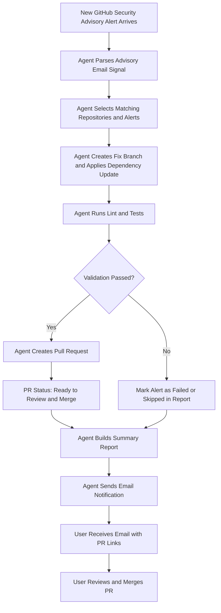
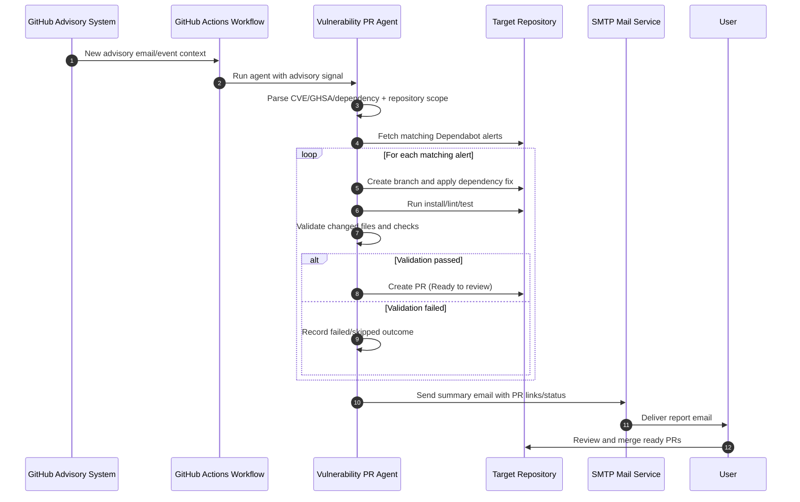
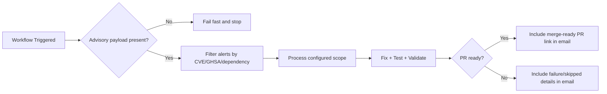

# Architecture

## Runtime
- Node.js + TypeScript service.
- Runs locally or in GitHub Actions via alert-driven dispatch only.

## Inputs
- GitHub token (`GITHUB_TOKEN`).
- Repository scope via one of:
	- `ALERT_REPOSITORIES` explicit list.
	- Auto-discovery (`ACCOUNT_LOGIN` with empty `ALERT_REPOSITORIES`).
	- Advisory email signal (`RAW_GITHUB_EMAIL`, `workflow_dispatch` input `advisory_email`, or `repository_dispatch` payload).
- Event gate: `PROCESS_ONLY_EMAIL_SIGNAL`.
- Optional per-repo command overrides (`REPO_COMMANDS`).

## Components
- `src/github/dependabot.ts`: Dependabot alert access and PR creation helpers.
- `src/parsers/githubEmailParser.ts`: advisory-email parsing (repositories, CVE, GHSA, dependency signal).
- `src/agents/fixAgent.ts`: Branch creation and dependency fix.
- `src/agents/testAgent.ts`: Lint/test execution.
- `src/agents/validationAgent.ts`: Final readiness checks.
- `src/notify/emailNotifier.ts`: SMTP summary notification.
- `src/agents/orchestrator.ts`: Main control flow.

## Safety
- Supports `DRY_RUN=true` for non-destructive trial runs.
- Limits alerts processed per repo.
- Skips alerts without available patched version.
- Uses temporary clone directory.
- Workflow enforces alert-driven signal processing (`PROCESS_ONLY_EMAIL_SIGNAL=true`).
- Repeated non-actionable runs do not send emails when no new alerts are detected.

## Operational Model
1. Trigger via `workflow_dispatch` or `repository_dispatch` with advisory payload.
2. Resolve target repositories from explicit list, advisory email, or account auto-discovery.
3. If advisory signal is missing: fail fast and stop processing.
4. Fetch open Dependabot alerts and filter by severity + advisory signal.
5. For each repository: reuse matching open Dependabot PR when possible, otherwise run batched local fix flow (one PR per repo).
6. Send summary email with created/skipped/failed status and merge-ready PR links.

## Flow Diagram

### Flow Notes
1. Flow starts only when a fresh advisory signal payload is present.
2. "Ready to Review and Merge" means the PR passed orchestration checks or a reusable Dependabot PR was found.
3. Email includes created PR links plus skipped/failed details and suggested actions.
4. Repeated non-actionable skip-only runs are suppressed from email notifications.

## Sequence Diagram

## Gate Diagram

## Workflow Dispatch Automation
`security-pr-agent.yml` supports runtime inputs:
- `advisory_email`
- `account_login`
- `alert_repositories`

Inputs override stored repository variables for that run, enabling one-off processing of a newly received advisory email without editing persistent settings.
