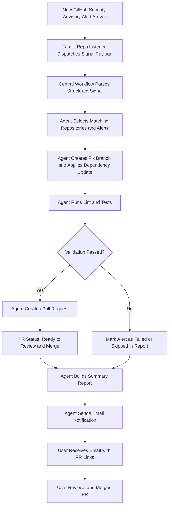
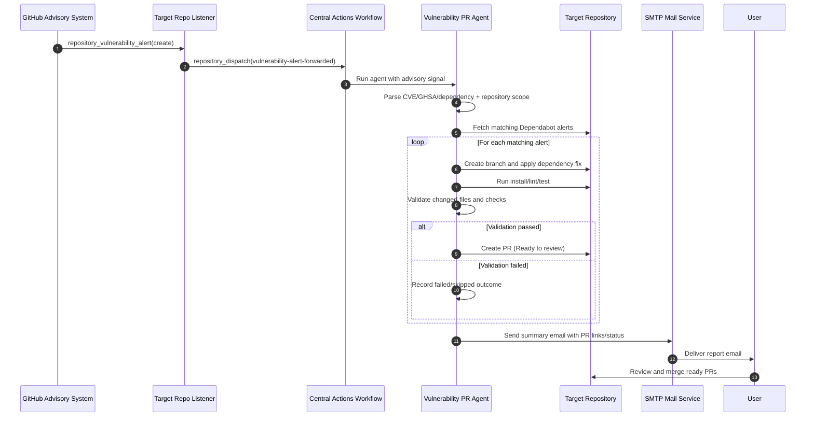
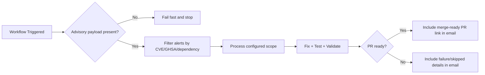

# Architecture

## Runtime
- Node.js + TypeScript service.
- Runs locally or in GitHub Actions via alert-driven dispatch only.

## Inputs
- GitHub token (`GITHUB_TOKEN`).
- Repository scope via one of:
	- `ALERT_REPOSITORIES` explicit list.
	- Auto-discovery (`ACCOUNT_LOGIN` with empty `ALERT_REPOSITORIES`).
	- Advisory email signal (`RAW_GITHUB_EMAIL`, `workflow_dispatch` input `advisory_email`).
	- Structured listener signal (`ADVISORY_SIGNAL_PAYLOAD` from `repository_dispatch` payload).
- Event gate: `PROCESS_ONLY_EMAIL_SIGNAL`.
- Optional per-repo command overrides (`REPO_COMMANDS`).

## Components
- `src/github/dependabot.ts`: Dependabot alert access and PR creation helpers.
- `src/parsers/githubEmailParser.ts`: advisory-email parsing (repositories, CVE, GHSA, dependency signal).
- `src/parsers/advisoryDispatchParser.ts`: structured dispatch parsing for repository listener events.
- `src/agents/fixAgent.ts`: Branch creation and dependency fix (multi-phase remediation, see below).
- `src/agents/testAgent.ts`: Lint/test execution.
- `src/agents/validationAgent.ts`: Final readiness checks.
- `src/notify/emailNotifier.ts`: SMTP summary notification.
- `src/agents/orchestrator.ts`: Main control flow.
- `src/utils/nodeRuntime.ts`: Per-repo Node runtime resolution and command wrapping.

## Fix Remediation Strategy (`fixAgent.applyFixBatch`)
The fix agent attempts remediation in ordered phases inside the cloned repo. Each phase
only acts on what previous phases left unresolved, then the batch flows to lint/test/validation.

1. **Phase 1 — `npm audit fix --package-lock-only`**: primary path. Uses npm's advisory graph
   to apply all automatically-patchable upgrades in one pass. Retries with `--legacy-peer-deps`
   when enabled.
2. **Phase 2 — Scoped overrides for nested transitives**: when a parent package pins an older
   nested copy (`node_modules/<parent>/node_modules/<dep>`), writes a scoped override
   (`overrides.<parent>.<dep>`), deletes the stale lock entry, and regenerates the lockfile.
3. **Phase 2b — Top-level overrides for hoisted transitives**: when a vulnerable dependency is
   hoisted to the top of `node_modules` and a parent pins an older range (common with Angular
   build tooling), audit fix leaves it untouched and only `npm audit fix --force` would move it.
   If the patched version is within the **same major** as the installed version (a
   semver-compatible bump) and the dependency is **not** a direct dependency, the agent forces a
   top-level override (`overrides.<dep> = ^<patchedVersion>`), deletes the stale top-level lock
   entry, and regenerates the lockfile. The downstream lint/test gate validates the result.
   Cross-major gaps are left as `breaking-upgrade` for manual review.
4. **Phase 3 — Node runtime upgrade**: when audit output reports `EBADENGINE` / "requires node
   >= X", bumps `engines.node` (and `.nvmrc` / `.node-version` if present) and re-runs Phase 1
   with the updated runtime.

If no files changed after all phases, the batch is skipped with the audit reason (typically a
genuine `breaking-upgrade` requiring `npm audit fix --force`).

## Safety
- Supports `DRY_RUN=true` for non-destructive trial runs.
- Limits alerts processed per repo.
- Uses temporary clone directory.
- Workflow enforces alert-driven signal processing (`PROCESS_ONLY_EMAIL_SIGNAL=true`).
- Repeated non-actionable runs do not send emails when no new alerts are detected.
- Duplicate alert-set processing is suppressed per repository to avoid repeated PR churn.

## Operational Model
1. Trigger via `workflow_dispatch` or `repository_dispatch` with advisory payload.
2. Resolve target repositories from explicit list, advisory email, listener signal payload, or account auto-discovery.
3. If advisory signal is missing: fail fast and stop processing.
4. Fetch open Dependabot alerts and filter by severity + advisory signal.
5. For each repository: suppress duplicate unchanged alert sets, then reuse matching open Dependabot PR when possible.
6. If no reusable PR exists: run batched local fix flow (one PR per repo) with per-repo runtime-aware commands.
7. If fix requires force/breaking upgrade: classify as `breaking-upgrade`, keep PR for manual review, and include recommendations.
8. If fix is low-risk/simple dependency-only change: auto-merge PR after successful checks.
9. Send summary email with auto-merged/manual-review/skipped/failed status and clear suggested actions.

## Flow Diagram

### Flow Notes
1. Flow starts only when a fresh advisory signal payload is present.
2. "Ready to Review and Merge" means the PR passed orchestration checks or a reusable Dependabot PR was found.
3. Some successful PRs are auto-merged when they meet low-risk criteria.
4. Email includes created/auto-merged PR status plus skipped/failed details and suggested actions.
5. Breaking-upgrade outcomes are called out explicitly with manual recommendation guidance.
6. Repeated non-actionable skip-only runs are suppressed from email notifications.

## Runtime and Merge Policy
- Runtime resolution order:
	- `REPO_COMMANDS[repo].nodeVersion` explicit override.
	- Repository `engines.node` major version from `package.json`.
	- Fallback to default runtime.
- Auto-merge eligibility:
	- Dependency-only changes.
	- No risky/manual flags from validation and classification.
	- Successful validation/test phase.
- Manual PR required when:
	- Breaking/force upgrades are needed.
	- Validation marks change as risky.
	- Fix output indicates major compatibility risk.

## Sequence Diagram

## Gate Diagram

## Workflow Dispatch Automation
`security-pr-agent.yml` supports runtime inputs:
- `advisory_email`
- `account_login`
- `alert_repositories`

Inputs override stored repository variables for that run, enabling one-off processing of a newly received advisory email without editing persistent settings.
