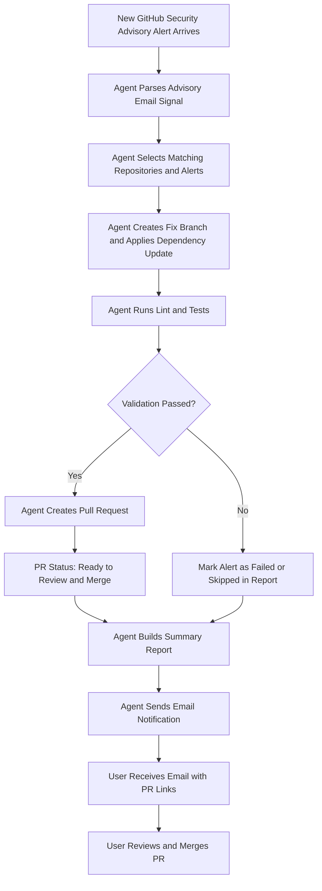
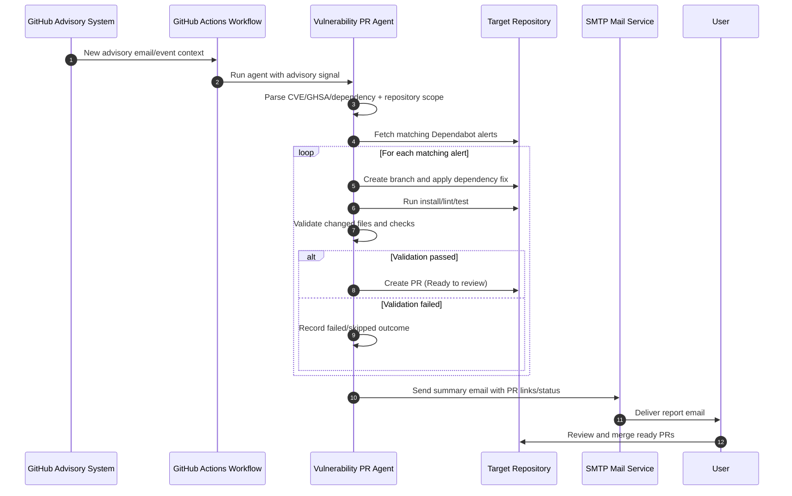
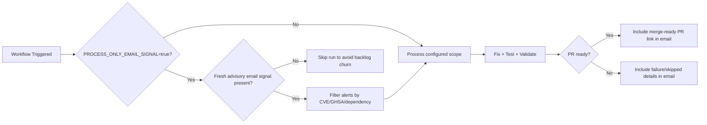

# Architecture

## Runtime
- Node.js + TypeScript service.
- Runs locally or in GitHub Actions (hourly schedule + manual dispatch).

## Inputs
- GitHub token (`GITHUB_TOKEN`).
- Repository scope via one of:
	- `ALERT_REPOSITORIES` explicit list.
	- Auto-discovery (`ACCOUNT_LOGIN` with empty `ALERT_REPOSITORIES`).
	- Advisory email signal (`RAW_GITHUB_EMAIL` or `workflow_dispatch` input `advisory_email`).
- Event gate: `PROCESS_ONLY_EMAIL_SIGNAL`.
- Optional per-repo command overrides (`REPO_COMMANDS`).

## Components
- `src/github/dependabot.ts`: Dependabot alert access and PR creation helpers.
- `src/parsers/githubEmailParser.ts`: advisory-email parsing (repositories, CVE, GHSA, dependency signal).
- `src/agents/fixAgent.ts`: Branch creation and dependency fix.
- `src/agents/testAgent.ts`: Lint/test execution.
- `src/agents/validationAgent.ts`: Final readiness checks.
- `src/notify/emailNotifier.ts`: SMTP summary notification.
- `src/agents/orchestrator.ts`: Main control flow.

## Safety
- Supports `DRY_RUN=true` for non-destructive trial runs.
- Limits alerts processed per repo.
- Skips alerts without available patched version.
- Uses temporary clone directory.
- `PROCESS_ONLY_EMAIL_SIGNAL=true` prevents backlog churn when no fresh advisory signal is present.

## Operational Model
1. Trigger via schedule or manual dispatch.
2. Resolve target repositories from explicit list, advisory email, or account auto-discovery.
3. If event-gated and no advisory signal: skip processing.
4. Fetch open Dependabot alerts and filter by severity + advisory signal.
5. For each matching alert: Fix -> Test -> Validate -> PR.
6. Send summary email with created/skipped/failed status and merge-ready PR links.

## Flow Diagram

### Flow Notes
1. With `PROCESS_ONLY_EMAIL_SIGNAL=true`, the flow starts only when a fresh advisory signal is present.
2. "Ready to Review and Merge" means the PR passed fix, test, and validation stages.
3. Email includes created PR links plus skipped/failed details for visibility.

## Sequence Diagram

## Gate Diagram

## Workflow Dispatch Automation
`security-pr-agent.yml` supports runtime inputs:
- `advisory_email`
- `account_login`
- `alert_repositories`
- `process_only_email_signal`

Inputs override stored repository variables for that run, enabling one-off processing of a newly received advisory email without editing persistent settings.
